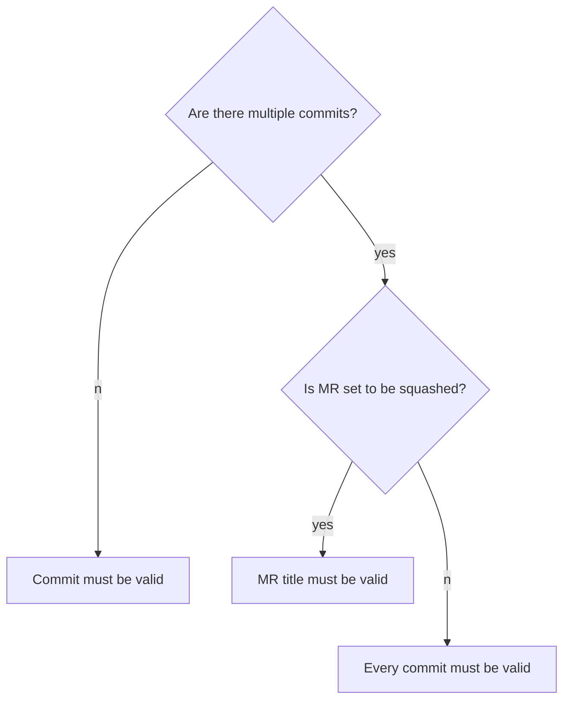

# Contributing Guide

## Developer Certificate of Origin + License

Contributions to this repository are subject to the [Developer Certificate of Origin](https://docs.gitlab.com/ee/legal/developer_certificate_of_origin.html#developer-certificate-of-origin-version-11).

All Documentation content that resides under the [docs/ directory](/docs) of this
repository is licensed under Creative Commons:
[CC BY-SA 4.0](https://creativecommons.org/licenses/by-sa/4.0/).

_This notice should stay as the first item in the CONTRIBUTING.md file._

---

Thank you for your interest in contributing to the GitLab CLI! This guide details how to contribute
to this extension in a way that is easy for everyone. These are mostly guidelines, not rules.
Use your best judgement, and feel free to propose changes to this document in a merge request.

Please do:

- Check existing issues to verify that the bug or feature request has not already been submitted.
- Open an issue if things aren't working as expected.
- Open an issue to propose a significant change.
- Open an issue to propose a feature.
- Open a merge request to fix a bug.
- Open a merge request to fix documentation about a command.
- Open a merge request for an issue and leave a comment claiming it.

Please avoid:

- Opening merge requests for issues marked `blocked`.
- Opening merge requests for documentation for a new command specifically. Manual pages are auto-generated from source after every release

## Code of Conduct

We want to create a welcoming environment for everyone who is interested in contributing. Visit our [Code of Conduct page](https://about.gitlab.com/community/contribute/code-of-conduct/) to learn more about our commitment to an open and welcoming environment.

## Maintainership

If you are a GitLab team member that is interested in becoming a maintainer of the CLI, we follow these basic steps [described in the handbook](https://about.gitlab.com/handbook/engineering/workflow/code-review/#accelerated-maintainer-onboarding-for-smaller-projects):

- Familiarize yourself with the codebase and past reviews.
- When you're ready, add yourself as a reviewer in your [team page](https://gitlab.com/gitlab-com/www-gitlab-com/-/blob/master/data/team_members/person/).
- After the current maintainers feel confident you're ready to be a maintainer, you're added
  to the project, and can update your team page again.

## Getting Started

### Reporting Issues

Create a [new issue from the "Default" template](https://gitlab.com/gitlab-org/cli/-/issues/new?issuable_template=Default) and follow the instructions in the template.

### Your First Code Contribution?

Read about the contribution process in [`development_process.md`](docs/development_process.md). This document explains how we review and release changes.

If your merge request is trivial (fixing typos, fixing a bug with 20 lines of code), create a merge request.

If your merge request is large, create an issue first. See [Reporting Issues](#reporting-issues) and [Proposing Features](#proposing-features). In the issue, the project maintainers can help you scope the work and make you more efficient.

### Building the project

Prerequisites:

- Go 1.22+

Build with: `make` or `go build -o bin/glab ./cmd/glab/main.go`

Run the new binary as: `./bin/glab`

### Running tests

Run tests with: `go test ./...` or `make test`.

There are some integration tests that perform real API requests to `https://gitlab.com`.
If the environment variables `GITLAB_TEST_HOST` and `GITLAB_TOKEN` are not set, the integration tests will fail in CI if
being run in the `gitlab-org/cli` project. They will be skipped locally or in forks if `GITLAB_TEST_HOST` and `GITLAB_TOKEN`
are both are omitted.
Integration tests use the `_Integration` test suffix and use the `_integration_test.go` file suffix.

`GITLAB_TEST_HOST` is set to `https://gitlab.com` in CI.

`GITLAB_TOKEN` must be a
[personal access token](https://docs.gitlab.com/ee/user/profile/personal_access_tokens.html) and requires the `api` scope.
To ensure the `glab duo` feature is functioning correctly, the token's user must have a GitLab Duo seat.

### Proposing Features

Create a [new issue from the "Feature Request" template](https://gitlab.com/gitlab-org/cli/-/issues/new?issuable_template=Feature%20Request) and follow the instructions in the template.

### Designing a new feature

The
[Design Command-Line Tools People Love presentation](https://www.youtube.com/watch?v=eMz0vni6PAw)
by Carolyn Van Slyck provides some great guidance on things to consider when implementing
a CLI tool. We recommend the entire presentation, but the following points are especially
important in the context of the GitLab CLI.

#### Grammar

GitLab CLI commands use a noun-first, verb-second grammatical structure, like
`glab ci list`. Also, these verbs are shared by various commands, and have
expected behavior as a result:

- `create` - Used when creating a singular object. For example, `glab mr create`
  creates a new merge request.
- `list` - Used by commands that output more than one object at a time. For example, 
  `glab ci list` returns a list of all running pipelines.
- `get` - Used by commands that output a singular object at a time. For example,
  `glab ci get --pipeline-id 1` returns the pipeline with the specified ID.
- `update` - Used by commands that update one object at a time. For example,
  `glab mr update 1 --title "new title"` updates the title of the merge request with ID `1`.
- `delete` - Used when deleting one or more objects at time. For example, `glab ci delete 1,2,3`
  deletes the pipelines with IDs `1`, `2`, and `3`.

Features generally have some or all of these commands. However, some features do not
map well to the listed commands. In situations like these, it's okay to create or
use separate verbs that make the most sense for the feature.

#### Precedent

When designing a feature, consider the existing ecosystem. It may be helpful to ask,
_"What's the most popular CLI tool in this domain?"_. The answer can help you decide
the terminology used, a preference for a flag instead of a positional argument, and
many more things. For example:

- When working on a Kubernetes-related feature, `kubectl` design patterns
  might play a big role designing feature's command set.
- When working on GitLab-specific features, use the current documentation and
  command list for design patterns.

Considering the context of use helps create a unifying experience that feels natural
to users who work with other tooling in the same domain space.

#### Human-readable output

Design with human readable output as the default. The
[`go-humanize`](https://github.com/dustin/go-humanize) module helps transform
various types into a human-friendly version. See the module's documentation for
a complete listing of the transformations supported.

### Submitting a merge request

1. Create a new branch: `git checkout -b my-branch-name`
1. Make your change, add tests, and ensure tests pass
1. Submit a merge request

### Formatting your code

We use [`golangci-lint`](https://golangci-lint.run/) to lint and format
the code in this project. The linter configuration can be seen
[here](https://gitlab.com/gitlab-org/cli/-/blob/main/.golangci.yml).

Additional details about code style and format are in the
[go guide](https://docs.gitlab.com/ee/development/go_guide/#code-style-and-format).

## Commit Messages

Each commit message consists of a **header**, a **body**, and a **footer**. The header has a special format that includes a **type**, a **scope**, and a **description**:

```plaintext
<type>(<scope>): <description>
<BLANK LINE>
<body>
<BLANK LINE>
<footer>
```

Each line in the commit message should be no longer than 72 characters.

### Message Header

The message header is mandatory, and should be a single line that contains a succinct description of the change containing a type, an optional scope, and a description. Ideally, it should not be more than 50 characters in length.

Following these conventions results in a clear changelog for every version.

It's generally a good idea to follow the conventions for your MR's title as well as for commit messages. This way, if your merge request is squashed upon merge, the maintainer can use its title as the final commit message, creating a properly-formatted history.

If your MR contains multiple commits but only one logical change, the [Squash commits when merge request is accepted](https://gitlab.com/help/user/project/merge_requests/squash_and_merge) option (enabled by default in this project) will allow GitLab to use the MR title as the commit message.

#### `<type>`

This describes the kind of change that this commit is providing

- **feat:** A new feature (adding a new component, providing new variants for an existing component, etc.).
- **fix:** A bug fix (correcting a styling issue, addressing a bug in a component's API, etc.).
  When updating non-dev dependencies, mark your changes with the `fix:` type.
- **docs:** Documentation-only changes.
- **style:** Changes that do not affect the meaning of the code
  (whitespace, formatting, missing semicolons, etc). _Not_ to be used for UI changes as those are
  meaningful changes, consider using `feat:` of `fix:` instead.
- **refactor:** A code change that neither fixes a bug nor adds a feature.
- **perf:** A code change that improves performance.
- **test:** Adding missing tests or correcting existing tests.
- **build:** Changes that affect the build system.
- **ci:** Changes to our CI/CD configuration files and scripts.
- **chore:** Other changes that don't modify source or test files. Use this type when adding or
  updating dev dependencies.
- **revert:** Reverts a previous commit.

Each commit type can have an optional scope to specify the place of the commit change: `type(scope):`. It is up to you to add or omit a commit's scope. When a commit affects a specific component, use the component's PascalCase name as the commit's scope. For example:

```plaintext
feat(statusbar): automatically switch pipelines
```

#### `<scope>`

Scope can be anything specifying the place of the commit change. For example events, kafka, userModel, authorization, authentication, loginPage, etc

#### `<description>`

This is a very short description of the change

- `use imperative, present tense: “change” not “changed” nor “changes”`
- `don't capitalize the first letter`
- `no dot (.) at the end`

### Message Body

Just as in the description, use imperative, present tense: “change” not “changed” nor “changes.” Include motivation for the change and contrast it with previous behavior.

#### More info on writing good Git commit messages

- [Writing Git commit messages](http://365git.tumblr.com/post/3308646748/writing-git-commit-messages)
- [A Note About Git Commit Messages](http://tbaggery.com/2008/04/19/a-note-about-git-commit-messages.html)

### Message Footer

Finished, fixed or delivered stories should be listed on a separate line in the footer prefixed with "Finishes", "Fixes" , or "Delivers" keyword like this:

`[(Finishes|Fixes|Delivers) #ISSUE_ID]`

### Message Example

```shell
feat(kafka): implement exactly once delivery

- ensure every event published to kafka is delivered exactly once
- implement error handling for failed delivery

Delivers #065
```

```shell
fix(login): allow provided user preferences to override default preferences

- This allows the preferences associated with a user account to
override and customize the default app preferences like theme or timezone.

Fixes #025
```

### Linting

We use the following logic to lint your MR's commit messages:


