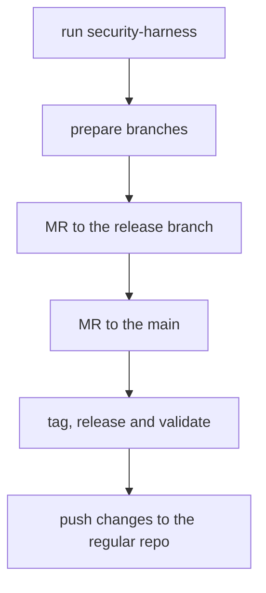

# Security Releases

This guide is based on the main [`gitlab-org/gitlab` security release process](https://gitlab.com/gitlab-org/release/docs/-/tree/master/general/security)

## DO NOT PUSH TO `gitlab-org/cli`

As a developer working on a fix for a security vulnerability, your main concern is not disclosing the vulnerability or the fix before we're ready to publicly disclose it.

To that end, you'll need to be sure that security vulnerabilities are fixed in the [Security Repo](https://gitlab.com/gitlab-org/security/cli).

This is fundamental to our security release process because the [Security Repo](https://gitlab.com/gitlab-org/security/cli) is not publicly-accessible.

## Process

A security fix starts with an issue identifying the vulnerability. In this case, it should be a confidential issue on the `gitlab-org/cli` project on [GitLab.com](https://gitlab.com/)

Once a security issue is assigned to a developer, we follow the same merge request and code review process as any other change, but on the [Security Repo](https://gitlab.com/gitlab-org/security/cli).

### Schema



### Preparation

Before starting, add the new `security` remote on your local GitLab repository:

```shell
git remote add security git@gitlab.com:gitlab-org/security/cli.git
```

Finally, run the `scripts/security_harness` script. This script will install a Git `pre-push` hook that will prevent pushing to any remote besides `gitlab.com/gitlab-org/security`, in order to prevent accidental disclosure.

Please make sure the output of running `scripts/security-harness` is:

```plaintext
Pushing to remotes other than gitlab.com/gitlab-org/security has been disabled!
```

### Request CVE number

For exploitable security issues, request a CVE number by [creating an issue in `gitlab-org/cves` project](https://gitlab.com/gitlab-org/cves/-/issues/new). **You can do the release before the CVE number is available.** When the CVE number is assigned, add it to the changelog entry. Here's an [example](https://gitlab.com/gitlab-org/gitlab-vscode-extension/-/blob/main/CHANGELOG.md#security) from the VS Code Project.

[Example CVE request](https://gitlab.com/gitlab-org/cves/-/issues/21)

### Branches

The main objective is to release the security fix as a patch of the latest production release and backporting this fix on `main`.

#### Patch release branch

Before starting the development of the fix, create a branch from the latest released tag. You can see the latest released tag on the [releases page](https://gitlab.com/gitlab-org/cli/-/releases). For example, if the latest release has a tag `v2.2.0` create a branch `security-2-2`. This is going to be the target of the security MRs. Push the branch to the security repo.

```shell
git checkout v2.2.2
git checkout -b security-2-2
git push security security-2-2
```

#### Security fix branch

Your fix is going to be pushed into `security-<issue number>` branch. If you work on issue #9999, you push the fix into `security-9999` branch.

```shell
git checkout security-2-2
git checkout -b security-9999
git push security security-9999
```

### Development

Here, the process diverges from the [`gitlab-org/gitlab` security release process](https://gitlab.com/gitlab-org/release/docs/-/blob/master/general/security/developer.md).

1. **Before developing the fix, make sure that you've already run the `scripts/security-harness` script.**
1. Implement the fix and push it to your branch (`security-9999` for issue #9999).
1. Create an MR to merge `security-9999` to the patch release branch (`security-2-2`) and get it reviewed.
1. Merge the fix (make sure you squash all the MR commits into one).

### Release the change

Follow the [regular release process](release_process.md) to tag a new patch version on the `security-2-2` branch and release it. Patch release for tag `v2.2.0` would have version and tag `v2.2.1`. Push the tag to the security repo.

Validate that the security issue is fixed in the released binary.

### Backport the fix to `main`

1. Create an MR to merge the security branch `security-2-2` to `main`. Don't squash commits. Delete source branch.
1. In the MR description, add references to all the reviewed MRs that were merged into `security-2-2`.
1. Review the MR and merge it. You don't need an additional reviewer because all of the changes have been reviewed.

[Example in VS Code extension](https://gitlab.com/gitlab-org/security/gitlab-vscode-extension/-/merge_requests/8), TODO: replace with example from CLI

## Push changes back to the CLI repository

1. Push the patch tag to the [CLI repository](https://gitlab.com/gitlab-org/cli).
1. Merge the [Security repository](https://gitlab.com/gitlab-org/security/cli) `main` branch with the
   [CLI repository](https://gitlab.com/gitlab-org/cli/) `main` and push to CLI repository.
